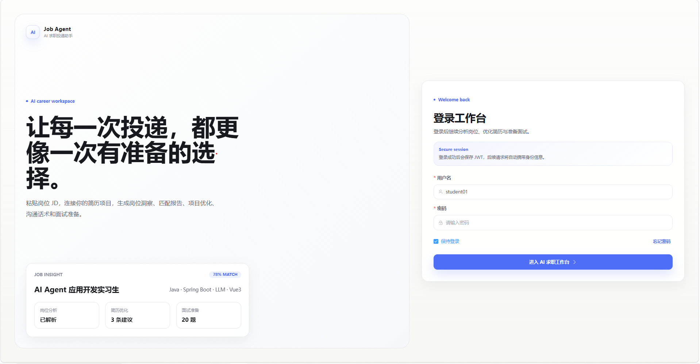
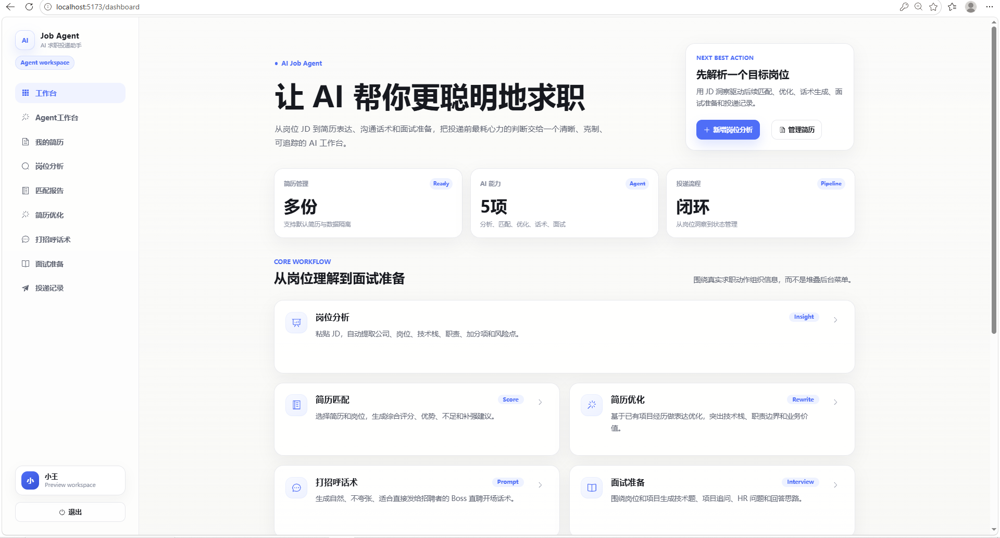
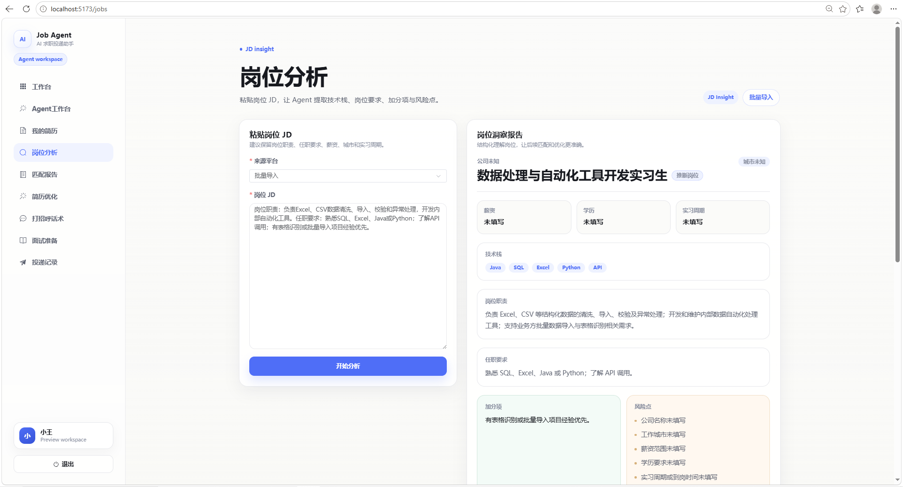
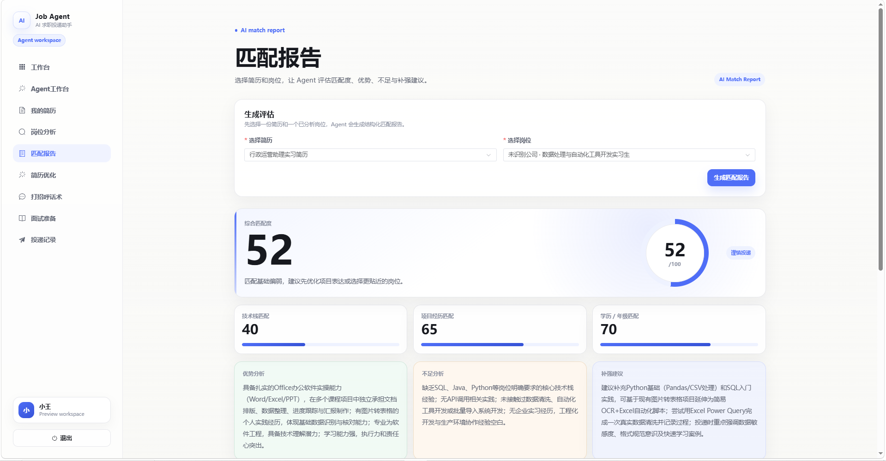
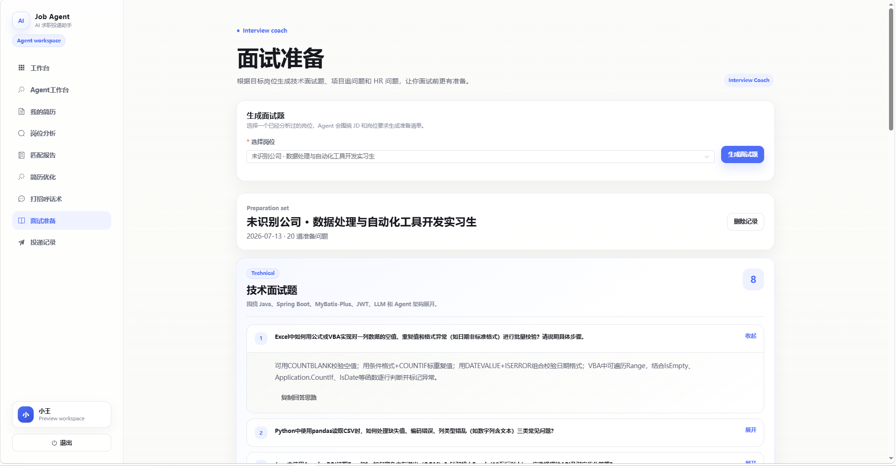

# AI Job Agent

AI Job Agent 是一个面向求职场景的智能投递助手，提供岗位 JD 分析、简历管理、简历匹配、项目经历优化、招呼语生成、面试题生成和投递记录管理等能力。项目采用 Java Spring Boot 后端、Python FastAPI AI 微服务和 Vue3 前端的三端架构。

## 核心功能

- 用户注册、登录和 JWT 鉴权
- 简历创建、编辑、查询和管理
- 岗位信息维护与 JD 分析
- 简历与岗位匹配报告生成
- 项目经历/简历内容 AI 优化
- 招呼语生成
- 面试题生成
- 投递计划与投递记录管理
- AI 调用日志、基础评估与 Mock AI 降级能力

## 技术架构

| 模块 | 技术栈 | 说明 |
| --- | --- | --- |
| Java 后端 | Spring Boot 3.3.6、MyBatis-Plus、MySQL、JWT、Knife4j | 提供业务 API、鉴权、数据持久化和 AI 调用编排 |
| Python AI 微服务 | FastAPI、Uvicorn、HTTPX、Pydantic | 封装大模型调用、AI 输出评估和关键词提取 |
| Vue 前端 | Vue3、Vite、Element Plus、Pinia、Axios | 提供求职助手工作台和各业务页面 |

## 项目目录结构

```text
ai-job-agent
├── ai-job-agent-backend/       # Java Spring Boot 后端
│   ├── src/main/java/          # 后端业务代码
│   └── src/main/resources/
│       ├── application.yml     # 环境变量化后的运行配置
│       ├── application-example.yml
│       └── sql/                # 数据库建表与升级脚本
├── ai-job-agent-ai-service/    # Python FastAPI AI 微服务
│   ├── app/
│   ├── requirements.txt
│   └── README.md
├── ai-job-agent-frontend/      # Vue3 + Vite 前端
│   ├── src/
│   ├── package.json
│   └── vite.config.js
├── .env.example                # 环境变量示例
├── .gitignore
└── README.md
```

## 数据库准备

1. 创建 MySQL 数据库：

```sql
CREATE DATABASE ai_job_agent DEFAULT CHARACTER SET utf8mb4 COLLATE utf8mb4_unicode_ci;
```

2. 按需执行 `ai-job-agent-backend/src/main/resources/sql/` 下的 SQL 文件。建议先执行基础表结构脚本，再执行带 `upgrade` 后缀的升级脚本。

3. 配置数据库连接环境变量：

```bash
DB_URL="jdbc:mysql://localhost:3306/ai_job_agent?useUnicode=true&characterEncoding=utf8&serverTimezone=Asia/Shanghai&useSSL=false&allowPublicKeyRetrieval=true"
DB_USERNAME="你的数据库用户名"
DB_PASSWORD="你的数据库密码"
```

## Java 后端启动

```bash
cd ai-job-agent-backend
mvn spring-boot:run
```

默认服务地址：

- 后端 API: `http://localhost:8080`
- Knife4j 文档: `http://localhost:8080/doc.html`

## FastAPI 微服务启动

```bash
cd ai-job-agent-ai-service
python -m venv .venv
.venv\Scripts\activate
pip install -r requirements.txt
uvicorn app.main:app --host 0.0.0.0 --port 8000
```

默认服务地址：

- 健康检查: `http://localhost:8000/health`
- API 文档: `http://localhost:8000/docs`

## Vue 前端启动

```bash
cd ai-job-agent-frontend
npm install
npm run dev
```

默认访问地址：`http://localhost:5173`

Vite 已配置 `/api` 代理到 `http://localhost:8080`。

## 环境变量配置

项目根目录提供 `.env.example`，请复制为本地 `.env` 或在系统环境变量中配置真实值。真实 `.env` 已被 `.gitignore` 排除，不要提交到仓库。

| 变量名 | 说明 | 示例 |
| --- | --- | --- |
| `DB_URL` | MySQL 连接地址 | `jdbc:mysql://localhost:3306/ai_job_agent?...` |
| `DB_USERNAME` | MySQL 用户名 | `ai_job_agent_user` |
| `DB_PASSWORD` | MySQL 密码 | `change-me` |
| `JWT_SECRET` | JWT 签名密钥，生产环境必须更换 | `please-change-this-jwt-secret-at-least-32-bytes` |
| `JWT_EXPIRATION_SECONDS` | Token 过期时间 | `86400` |
| `LLM_PROVIDER` | AI 提供方，可使用 `mock`、`fastapi`、`deepseek`、`groq`、`qwen` | `mock` |
| `DEEPSEEK_API_KEY` | DeepSeek API Key | 留空或填真实值 |
| `GROQ_API_KEY` | Groq API Key | 留空或填真实值 |
| `DASHSCOPE_API_KEY` | 通义千问 DashScope API Key | 留空或填真实值 |
| `AI_SERVICE_BASE_URL` | FastAPI 微服务地址 | `http://localhost:8000` |

## 项目截图

> 以下图片使用相对路径引用。请将真实运行截图放入 `docs/images/` 目录后再提交。

### 登录页

Vue3 前端登录界面，展示 AI Job Agent 的入口页与基础鉴权流程。



### 工作台

Vue3 前端工作台界面，集中展示岗位分析、简历管理、匹配报告和 AI 能力入口。



### 岗位分析

岗位 JD 智能解析页面，支持粘贴岗位 JD，并提取岗位要求、技术栈、加分项和风险点。



### 匹配报告

简历与岗位匹配评分页面，展示综合匹配度、分项评分、优势分析、不足分析和补强建议。



### AI 面试准备

AI 面试准备页面，根据岗位信息和简历内容，生成针对性的面试问题和准备建议。



## 已实现功能

- 后端基础业务模块、JWT 鉴权、MyBatis-Plus 数据访问
- 用户、简历、岗位、匹配报告、招呼语、面试题、投递计划和投递记录模块
- AI 服务路由、Mock AI 降级、多供应商配置
- FastAPI 微服务的聊天、评估和关键词接口
- Vue3 前端页面、路由、状态管理和接口封装

## 后续计划

- 增加自动化测试与接口回归测试
- 完善 Docker Compose 一键启动
- 增加正式截图和演示数据
- 完善线上环境配置示例
- 扩展更多招聘平台投递流程适配
